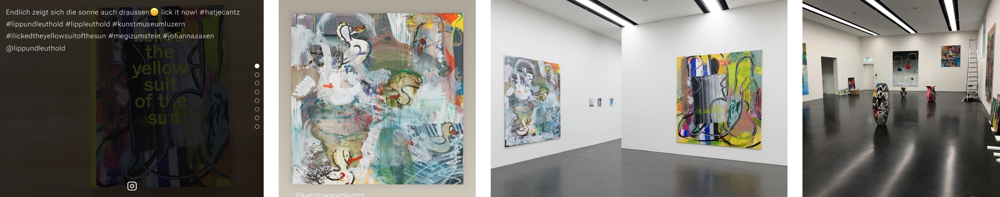

# Silverstripe instagram-basic-display-feed-element
Instagram feed in a dnadesign/silverstripe-elemental-element. It utilizes [espresso-dev/instagram-php](https://github.com/espresso-dev/instagram-php) and caches the API-response for performance reasons. Since different scrapers lead to all sorts of problems - mostly cookie/session related, this module came to existence. `appId` & `appSecret` are stored in `yml`-config or `.env`, the rotating token in DB. The API is read-only for "public" data anyway.

Note: https://github.com/espresso-dev/instagram-php is used and not https://github.com/espresso-dev/instagram-basic-display-php anymore, still `instagram_business_basic` scope is in use.

[](LICENSE.md)


Example in action from <a href="https://lippundleuthold.ch/info/#instagram" target="_blank">Lipp&Leuthold</a>


# Installation
Composer is the recommended way installing Silverstripe modules.
```
composer require lerni/instagram-basic-display-feed-element
```
* Run a `dev/build?flush`

## Requirements
* Silverstripe 5.x
* dnadesign/silverstripe-elemental
* espresso-dev/instagram-php 1.x

## Configuration
You'll need to setup a [FB App](https://developers.facebook.com/docs/instagram-basic-display-api/getting-started/) for basic display and set `appId` & `appSecret` ([Instagram not FB](https://stackoverflow.com/questions/60258144/invalid-platform-app-error-using-instagram-basic-display-api)). `redirectUri` will be `DYNAMICALLY-SET-HOST.TLD/_instaauth/` but you can also set it explicit with a domain per yml-config. Make sure to configure the correct values (e.g. dev-url) in your FB App! If no token is generated yet, you'll find a link to generate one in the setting-tab of the element. The token 'll be renewed automatically (on request basis) if older than 30 days.

1. Install the module
2. Create a [FB App](https://developers.facebook.com/docs/instagram-basic-display-api/getting-started/) use `https://DOMAIN.TLD/_instaauth/` as redirectUri
3. Add `appId` & `appSecret` in yml-config or `.env` like below & `?flush`
4. Create an Instagram Feed Element & click on the link in the setting-tab to authenticate
5. Reload CMS to see the generated token
6. That's it. Token 'll be updated if older than 30 days on request basis. This means, if a token is older than 30 days and from there on no request is made (element never shown to any visitor), the token invalidates and a warning is thrown. To "fix" this, you'll need to delete all tokens and regenerate one with the link provided in CMS.

```yaml
Kraftausdruck\InstagramFeed\Control\InstaAuthController:
  credentials:
    appId: '2598599940246020'
    appSecret: '7e29795bva6d352e3286769ff3a3a836'
    # redirectUri: 'https://example.tld/_instaauth/'
```
```.env
KRAFT_INSTAFEED_APP_ID='2598599940246020'
KRAFT_INSTAFEED_APP_SECRET='7e29795bva6d352e3286769ff3a3a836'
```

# Styling
Example SCSS square-styles with text as hover overlay. [Feather Icons](https://feathericons.com/) are suggested - you need to load those yourself.
```scss
$lh: 1.41;
$white: #fff;
.instafeed {
	display: flex;
	flex-wrap: wrap;
	margin-left: -1px;
	margin-right: -1px;
	width: calc(100% + 2px);
	a {
		outline: none;
		overflow: hidden;
		position: relative;
		display: block;
		width: auto;
		height: 500px;
		@include breakpoint($Lneg) {
			height: 400px;
		}
		@include breakpoint($Sneg) {
			height: 300px;
		}
		figure {
			height: 100%;
			margin: 0;
			img {
				object-fit: cover;
				margin-bottom: 0;
				max-width: none;
				width: 100%;
				height: 100%;
			}
			figcaption {
				position: absolute;
				top: 0;
				left: 0;
				right: 0;
				bottom: 0;
				opacity: 0;
				transition: opacity 120ms linear;
				z-index: 1;
				color: $white;
				font-size: .8em;
				padding: #{math.div($lh,2)}em;
				display: flex;
				flex-direction: column;
				background-color: rgba(0,0,0,.8);
				span[data-feather="instagram"] {
					transition: transform 120ms linear;
					transform: scale(.4);
					width: 1.4em;
					height: 1.4em;
					background-image: svg-load('../images/svg/instagram.svg', stroke=#{$white});
					margin: auto auto 0 auto;
				}
			}
			&:hover {
				figcaption {
					opacity: 1;
					span[data-feather="instagram"] {
						transform: scale(1);
					}
				}
			}
		}
		video {
			height: 100%;
			width: 100%;
		}
	}
}
```
# Troubleshooting
If things go wrong, you may want to check [Facebook Platform Status](https://metastatus.com/).

