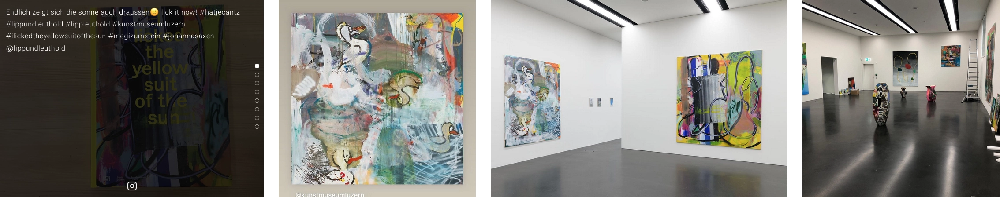

# Silverstripe instagram-basic-display-feed-element
Instagram feed in a dnadesign/silverstripe-elemental-element. It utilizes [espresso-dev/instagram-php](https://github.com/espresso-dev/instagram-php) and caches the API-response for performance reasons. Since different scrapers lead to all sorts of problems - mostly cookie/session related, this module came to existence. `appId` & `appSecret` are stored in `yml`-config or `.env`, the rotating token in DB.

[](LICENSE)


Example in action from <a href="https://lippundleuthold.ch/info/#instagram" target="_blank">Lipp&Leuthold</a>


# Installation
Composer is the recommended way installing Silverstripe modules.
```
composer require lerni/instagram-basic-display-feed-element
```
* Run a `dev/build`

## Requirements
* Silverstripe 6.x
* dnadesign/silverstripe-elemental
* espresso-dev/instagram-php 1.x

## Configuration
You'll need to set up a [FB App](https://developers.facebook.com/docs/instagram-platform) and set `appId` & `appSecret` ([Instagram not FB](https://stackoverflow.com/questions/60258144/invalid-platform-app-error-using-instagram-basic-display-api)). `redirectUri` will be `DYNAMICALLY-SET-HOST.TLD/_instaauth` but you can also set it explicitly with a domain per yml-config. Make sure to configure the correct values (e.g. dev-url) in your FB App! If no token is generated yet, you'll find a link to generate one in the settings tab of the element. The token 'll be renewed automatically (on request basis) if older than 30 days.

1. Install the module
2. Create a [FB App](https://developers.facebook.com/docs/instagram-platform) use `https://DOMAIN.TLD/_instaauth` as redirectUri
    - create an Instagram app on https://developers.facebook.com/apps/?locale=en_US
        - click on "Create App"
            - Filter all
            - choose "Manage messaging & content on Instagram"
        - On Dashboard personalize "Messaging und Content"
            - Copy "Instagram app ID" add it to KRAFT_INSTAFEED_APP_ID in .env
            - Copy "Instagram app secret" add it to KRAFT_INSTAFEED_APP_SECRET in .env
            - Make sure "instagram_business_basic" is set
            - Set "Callback URL" to https://DOMAIN.TLD/_instaauth
            - Set "Verify token" to the same as `KRAFT_INSTAFEED_VERIFICATION_TOKEN` in .env (something random)
            - "Set up Instagram business login" you can use https://DOMAIN.TLD/_instaauth again
        Sometimes you just can't - try reloading, different browser or do some other black magic :shrug:
    - add Instagram-Tester (Roles → Add → Instagram-Tester)
    - Login on Instagram & accept/confirm
        - Settings
            - Website Permissions
                - Apps and Websites
                    - Accept Tester Invitations
3. Add `appId`, `appSecret` & `verificationToken` in yml-config or `.env` like below & `?flush`
    - make sure to use the credentials from the Instagram settings, not the general App Settings!
4. Create an Instagram Feed Element & click on the link in the settings tab to authenticate
5. Reload CMS to see the generated token
6. That's it. The token will be updated if older than 30 days on request basis. This means, if a token is older than 30 days and from then on no request is made (element never shown to any visitor), the token invalidates and a warning is thrown. To fix this, delete all tokens and regenerate one with the link provided in CMS.

```yaml
Kraftausdruck\InstagramFeed\Control\InstaAuthController:
  credentials:
    appId: '2598599940246020'
    appSecret: '7e29795bva6d352e3286769ff3a3a836'
    verificationToken: 'SetThisToSomethingRandom'
    # redirectUri: 'https://example.tld/_instaauth'
```
```.env
KRAFT_INSTAFEED_APP_ID='2598599940246020'
KRAFT_INSTAFEED_APP_SECRET='7e29795bva6d352e3286769ff3a3a836'
KRAFT_INSTAFEED_VERIFICATION_TOKEN='SetThisToSomethingRandom'
```

# Styling
Example styling with text as hover overlay.
<details>
<summary>CSS with a bit PostCSS magic</summary>


```css
.instafeed {
	display: flex;
	flex-wrap: wrap;
	margin-left: -1px;
	margin-right: -1px;
	width: calc(100% + 2px);
	a {
		outline: none;
		overflow: hidden;
		position: relative;
		display: block;
		width: auto;
		height: 500px;
		@media (max-width: 980px) {
			height: 400px;
		}
		@media (max-width: 480px) {
			height: 300px;
		}
		figure {
			height: 100%;
			margin: 0;
			img {
				object-fit: cover;
				margin-bottom: 0;
				max-width: none;
				width: 100%;
				height: 100%;
			}
			figcaption {
				position: absolute;
				inset: 0;
				opacity: 0;
				transition: opacity 120ms linear;
				z-index: 1;
				color: var(--white);
				font-size: var(--font-size--small);
				padding: calc(var(--lh) * 1em);
				display: flex;
				flex-direction: column;
				background-color: rgba(0,0,0,.8);
				span[data-icon="instagram"] {
					transition: transform 120ms linear;
					transform: scale(.4);
					width: calc(var(--lh) * 1em);
					height: calc(var(--lh) * 1em);
					background-image: svg-load("instagram.svg", stroke=#fff);
					margin: auto auto 0 auto;
				}
			}
            @media (hover: hover) {
                &:hover {
                    figcaption {
                        opacity: 1;
                        span[data-icon="instagram"] {
                            transform: scale(1);
                        }
                    }
                }
            }
		}
		video {
			height: 100%;
			width: 100%;
		}
        @media (hover: none) {
            &:focus,
            &:focus-within,
            &:active {
                figure figcaption {
                    pointer-events: none;
                    opacity: 1;
                    span[data-icon="instagram"] {
                        transform: scale(1);
                    }
                }
            }
        }
	}
}
```
</details>

# Troubleshooting
If things go wrong, you may want to check [Facebook Platform Status](https://metastatus.com/).

